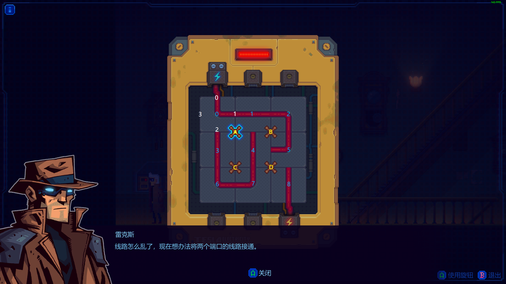

# 解决电线谜题

《迷雾侦探》第一章中的接通电线问题，实在手残试不出来，遂写代码暴力破解之=。=

## 运行方法

无需安装 `nodejs` ，拥有 vscode 和 docker 即可，附带容器内调试配置（`.devcontainer` 目录）。

```bash
node solve.js

> final solutions:
- BCBBB
- CBBDB
- DAAADA
- DBBCD
- DBCDBD
- DBDBCD
- DCD
- DDDCD
```

## 编程模型

目标：通过连续操作旋钮，连通左上角和右下角的电门。

- A、B、C、D 代表四个旋钮，按动旋钮，则将附近四个砖块，整体旋转90°
- 0、1、2、3 代表四个触点，每个砖块的电线都连接两个触点
- 0、1、2、3、4、5、6、7、8 代表九个砖块



## 解法动画

跑出来结果，发现真的被自己蠢哭，最短路径“DCD”，点三下鼠标就完事儿了……

